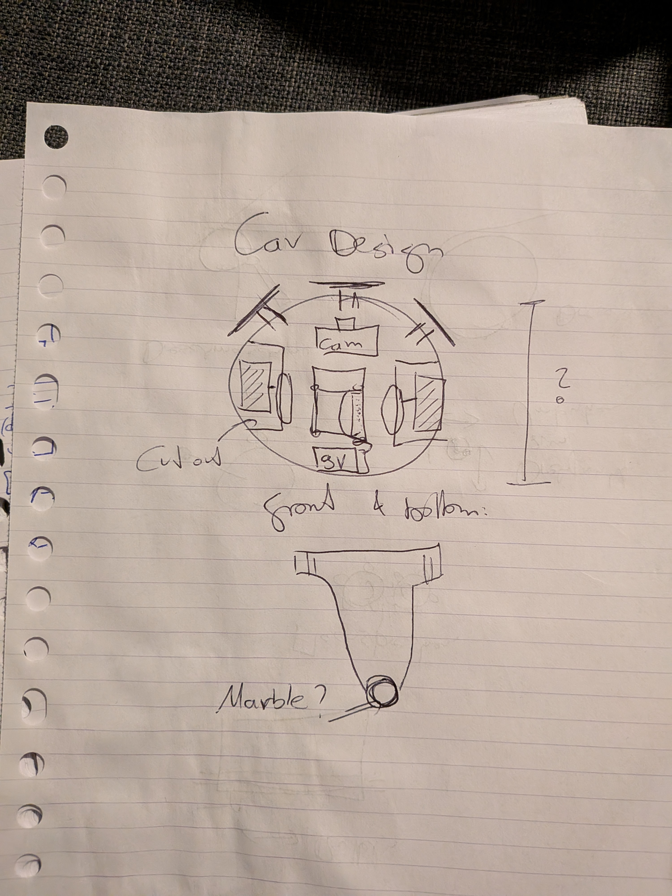
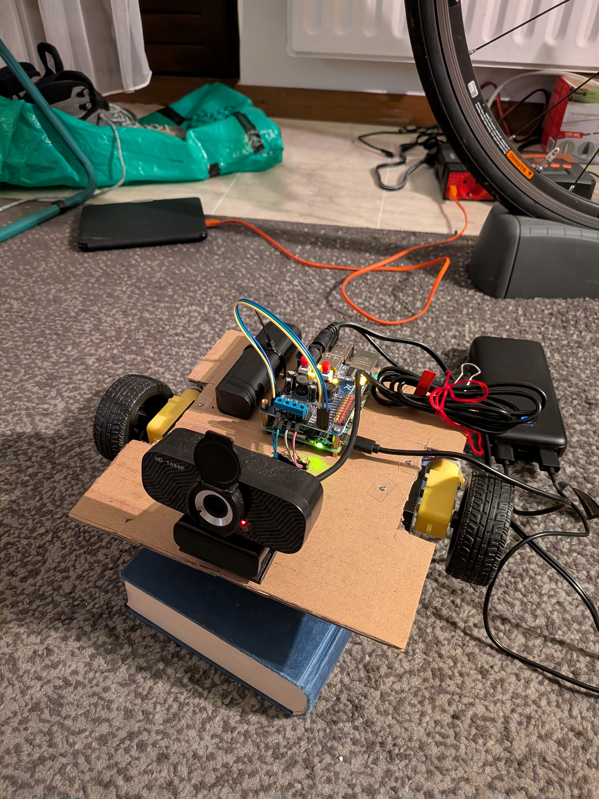
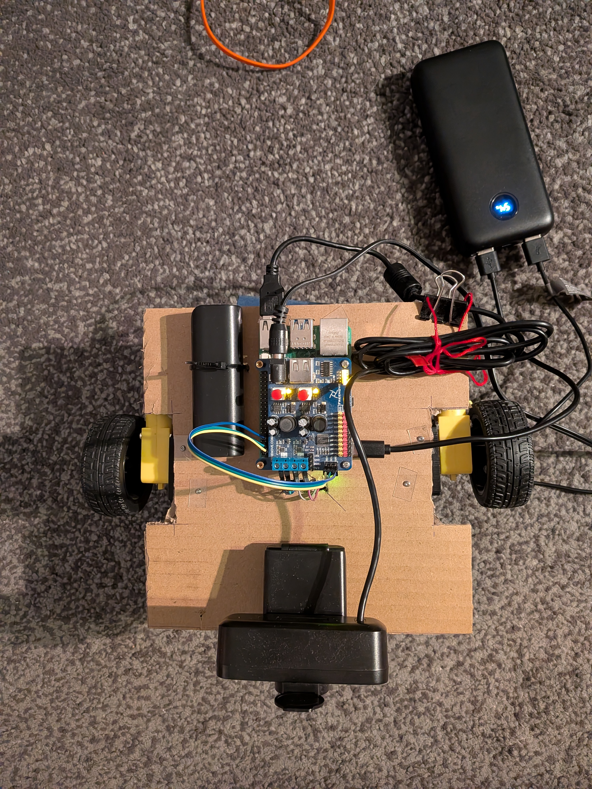
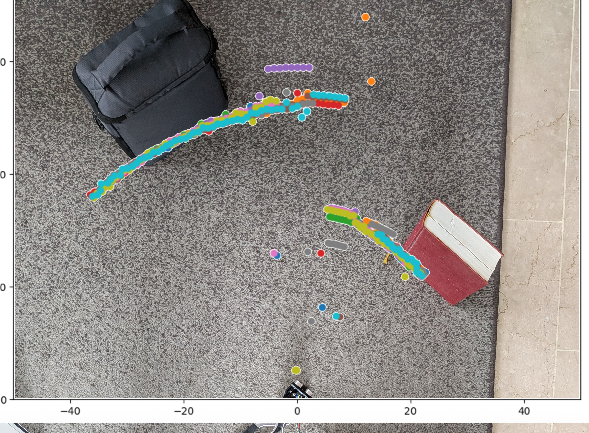

# Robot Car v3

## Objectives:
### P0: no obstacles
* robot car can drive towards a static target ✅
* robot car can follow a moving target ✅

Goal achieved using [Mobile Net SSD](https://github.com/chuanqi305/MobileNet-SSD) for person detection, the robot can follow an object, assuming there are not obstacles in the way. 

The robot uses a multi-threaded approach for: image capturing & person detection, sending control commands to the motors for setting the driving direction.

Using Mobile Net SSD instead of [Yolo v12n](https://docs.ultralytics.com/models/yolo12/) the latency to detect a person dropped from 0.35 sec to 0.095 sec (-73% detection latency) on a [Raspberry Pi 5 - 8GB](https://www.raspberrypi.com/products/raspberry-pi-5/) allowing for ~10 FPS.
### P1: obstacles
* robot car can drive towards a static target *redirecting when bumping into obstacles*
* robot car can follow a moving target *redirecting when bumping into obstacles*
### P2: obstacle avoidance
* robot car can drive towards a static target *avoiding obstacles*
* robot car can follow a moving target *avoiding obstacles*

## Robot Design
### P0:
* [Vacuum Robot inspired design](https://cookierobotics.com/056/): circular body-shape, 2 main wheels, caster wheel in the back
* camera mount (looking to the front)
* battery holders for 9V battery (and powerbank)
### P1:
* front: button bar to detect contact - 3 separate buttons: half-left, front, half-right
* expand adding Sonic Senor & Compass for Self-Localization
### P2:
* laser distance sensors for more accurate detection of obstacles in front & self-localization

## Self-Driving capabilities
### P0:
* drive towards a defined object - object detection - correct steering to keep object in center (single object)
* adjust directions for moving targets
### P1:
* when detecting an obstacle (bumping into - detect obstacle direction with 3 button setup) - drive around (pre-programmed manoeuvers)
### P2:
* drive to defined position, obstacle avoidance (using sensors)
* path finding - drive towards object but account for obstacles
* internal mapping - given a room map (and the current position) - drive towards a position

## Design & Building
* wheel holders
* space for boards (Raspberry Pi & controller shield) - buy screws?
* cardboard model first?

## Distance sensing using ultra-sonic sound

* sweep the positions ahead (-45° - +45° (0° = straight ahead))
* measure the distance
* stop the car if any object ahead is getting too close ("emergency stop")
* use the detected object shapes to decide how to navigate across them (is an object on the right side -> derive around on the left - path-finding algorithm)

### Issues:
* ultra-sonic sound distances can fluctuate & are propne for polished object surfaces (*average over multiple sensor reads*)
* the sensor ([HC-SR04](https://howtomechatronics.com/tutorials/arduino/ultrasonic-sensor-hc-sr04/#hc-sr04-hardware-overview)) itself has a 15° measuring angle, meaning the object boundaries are fuzzy

## Steering
Idea:
* get current heading
* set target heading (based on desired offset)
 * register in compass (with degree of error)
* start motion, callback to stop
* compass triggers callback once reaching the desired position
 * stop motors

Implementation:
* compass: separate thread
 * API: standard granularity (5°?), register callback: target heading, function, once / repeatedly
 * store headings & callbacks, every loop (200 readings / second -> 0.005 wait time) delay -> check headings & whether to trigger some callback
  * store callbacks in Hashmap & read current [head - granularity / 2, head + granularity / 2] -> for each retrieved heading, callback pair -> call callback